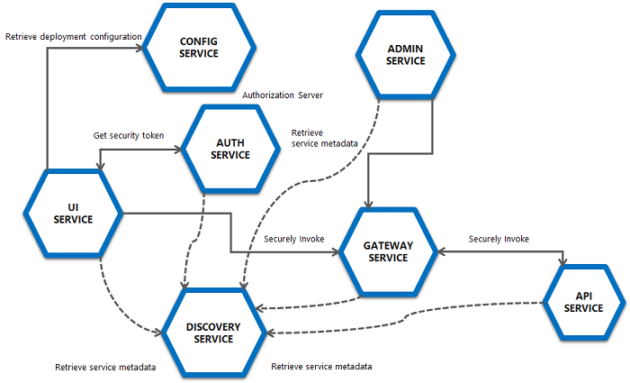

# 卓越亲子阅读

## FEATURES:
* Build and testing process integrated with maven
* Spring cloud microservices with service discovery
* Spring security Oauth2 integration
* Spring Boot application in development mode use resources from webpack dev server
* Docker integration (optional)
* Webpack2 integration
* Scss support in angular components
* Angular material integration
* Font-awesome integration
* Lazy loaded routes
* Spring Boot admin support
* Spring REST Docs support

## MICROSERVICES:



## USAGE WITH DOCKER (RECOMMENDED)

### DOCKER BUILD (PRODUCTION MODE):

Build the docker image for all services with default maven profile

```
mvn install
```

### DOCKER BUILD (DEVELOPMENT MODE):

Build the docker image for all services with dev maven profile
To use development mode you need also webpack development server running in background

```
mvn install -P dev
```

### RUNNING CONTAINERS:

After building applications run all containers with docker-compose

```
docker-compose up
```

## STANDALONE USAGE WITHOUT DOCKER (NO LONGER RECOMMENDED)

### RUNNING IN PRODUCTION MODE:

If you want to work without docker you need to use prod-standalone maven profile

Compile and package project:
```
mvn clean package -P prod-standalone
```

Then run config server:
```
cd zhuoyue-config/
java -jar ./target/zhuoyue-config-2.1.0.jar
```

Then run discovery server:
```
cd zhuoyue-discovery/
java -jar ./target/zhuoyue-discovery-2.1.0.jar
```

Then run gateway server:
```
cd zhuoyue-gateway/
java -jar ./target/zhuoyue-gateway-2.1.0.jar
```

Then run api server:
```
cd zhuoyue-api/
java -jar ./target/zhuoyue-api-2.1.0.jar
```

Then run auth server:
```
cd zhuoyue-auth/
java -jar ./target/zhuoyue-auth-2.1.0.jar
```

Then run ui server:
```
cd zhuoyue-api/
java -jar ./target/zhuoyue-ui-2.1.0.jar
```


Then run admin server (optional):
```
cd zhuoyue-admin/
java -jar ./target/zhuoyue-admin-2.1.0.jar
```


### RUNNING IN DEVELOPMENT MODE:

If you want to work without docker you need to use dev-standalone maven profile
To use development mode you need also webpack development server running in background

Install all dependencies at first:
```
mvn clean install -P dev-standalone
```

Run config server in development mode:
```
cd zhuoyue-config
mvn spring-boot:run -P dev-standalone
```

Run discovery server in development mode:
```
cd zhuoyue-discovery
mvn spring-boot:run -P dev-standalone
```

Run gateway server in development mode:
```
cd zhuoyue-gateway
mvn spring-boot:run -P dev-standalone
```

Run api server in development mode:
```
cd zhuoyue-api
mvn spring-boot:run -P dev-standalone
```

Run auth server in development mode:
```
cd zhuoyue-auth
mvn spring-boot:run -P dev-standalone
```

Run ui server in development mode:
```
cd zhuoyue-ui
mvn spring-boot:run -P dev-standalone
```

Run admin server (optional) in development mode:
```
cd zhuoyue-admin
mvn spring-boot:run -P dev-standalone
```

## RUNNING WEBPACK DEV SERVER FOR DEVELOPMENT MODE:

Run webpack development server:
```
cd zhuoyue-ui
npm run server
```

## TESTING ANGULAR FRONTEND

Running unit tests:
```
cd zhuoyue-ui
npm run test
```

Running e2e tests:
```
cd zhuoyue-ui
npm run e2e
```


